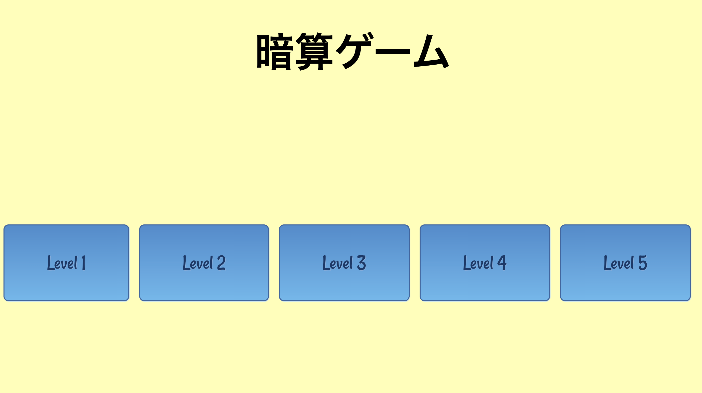
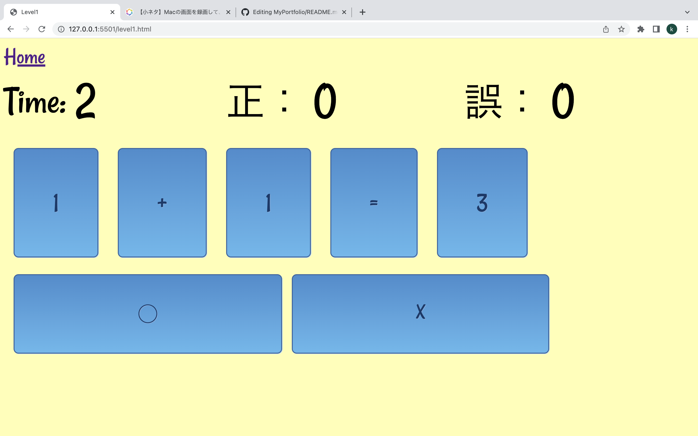

# Mental Arithmetic Game

今回のプロジェクトは学校の演習に課題としてゲーム作成を挑戦してみた。

## 外観

 ホーム画面

 Level 1

## 仕様技術
<ul>
<li>Vanilla html, CSS, JavaScript
<li>VsCode
<li>CSS3
</ul>

## デモ
[Demo](https://zxcwer.github.io/mentalArithmeticGame/index.html)